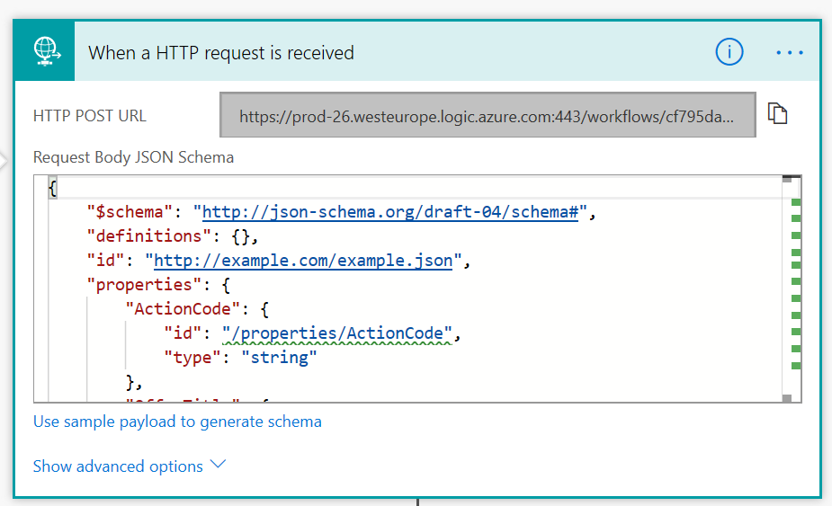

# PartnerPortal HubSpot Integration
This ARM template will add a Logic App to your Azure Subscription to create a integration between Microsoft PartnerPortal and HubSpot when a new lead is created in partner portal when a potential customer fills in the
Contact Me Form.

Creates a solution to add a lead from partnerportal.azure.com to HubSpot.

An APIKEY from HubSpot is required.

  

To add the Logic App to your Azure subscription click below link:

Enter the information including the HubSpot API key in the Azure Deployment Form

  

After deployment go to the edit blade of the logic app and copy the url of the Request Trigger Action. Use this URL in the https://partner.microsoft.com/en-us/dashboard Lead Configuration as HTTPS endpoint.

  

