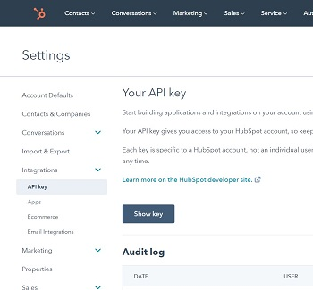
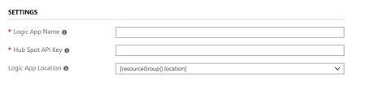
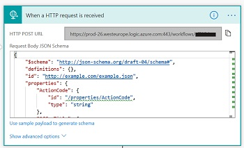

# Cloud Partner Portal - HubSpot Integration

This ARM template will add a Logic App to your Azure Subscription to create a integration between Microsoft Cloud Partner Portal and HubSpot. 

When a new goes trough the 'Contact Me' form in the Azure Marketplace or Microsoft AppSource the data has to be handled by a HTTP Endpoint. 
This example shows how to build this endpoint to process the data from the 'Contact Me' form via a Logic App. 
This implemention uses HubSpot as an example backend but using a logic app, you could do anything from sending an email to creating a record in a SQL Database.

To add the Logic App to your Azure subscription click below link:

An Api-Key from HubSpot is required for this example to work end to end. You can get this Api Key via the HubSpot settings:

 
Enter the information including the HubSpot API key in the Azure Deployment Form

After deployment go to the edit blade of the logic app and copy the url of the Request Trigger Action, in the grey box: 

 

Use this URL in the Lead Configuration section of the 'Cloud Partner Portal' as HTTPS endpoint.
 